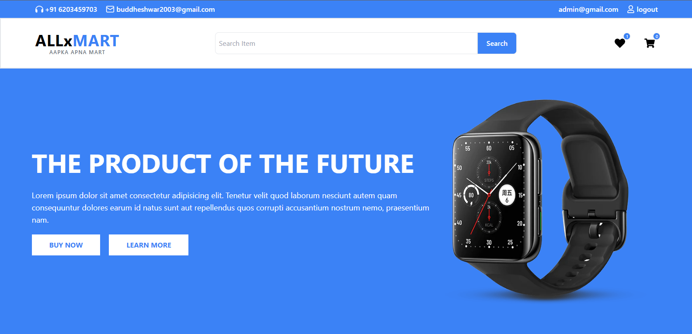

# 🛒 React + Firebase Cart App

A simple **React + TypeScript + Firebase** project that lets users:

- Add products to cart
- Store cart data in **Firestore** (per logged-in user)
- Sync cart across sessions
- Clear cart with one click

---

## 🚀 Features

- 🔑 User Authentication (Firebase Auth)
- 🛍️ Add / Remove products from cart
- 💾 Persistent cart stored in **Firestore**
- 💻 React Context API for global state
- 📦 LocalStorage fallback when not logged in
- 🎨 Tailwind CSS styling (optional)

---

## ⚙️ Tech Stack

- **React + Vite + TypeScript**
- **Firebase (Auth)**
- **React Context API**
- **Tailwind CSS** (UI styling)

---

## 📂 Project Setup

### 1. Clone Repo + 📦 Installation

```bash
git clone https://github.com/buddheshwar2003/E-Commerce-Web.git
cd E-Commerce-Web
npm install
npm run dev
```

### 🔑 Environment Variables Setup

Create a `.env` file in the **root** of your project (where `package.json` is located).

Add your Firebase credentials like this:

```env
VITE_FIREBASE_API_KEY=your_api_key_here
VITE_FIREBASE_AUTH_DOMAIN=your_project.firebaseapp.com
VITE_FIREBASE_PROJECT_ID=your_project_id
VITE_FIREBASE_STORAGE_BUCKET=your_project.appspot.com
VITE_FIREBASE_MESSAGING_SENDER_ID=your_sender_id
VITE_FIREBASE_APP_ID=your_app_id
```

## 📸 Preview



---

---
## 🔗 Live Demo

👉 [View Live Site](https://weather-api-website-one.vercel.app//)

---

